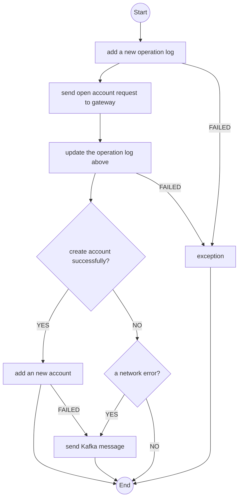

```mermaid
graph TB
  startPoint((Start)) --> addLog[add a new operation log]

  addLog --> gatewayRequest[send open account request to gateway]

  addLog -- FAILED --> exception

  gatewayRequest --> updateLog[update the operation log above]

  updateLog --> success{create account successfully?}

  updateLog -- FAILED --> exception

  success -- YES --> addAccount[add an new account]

  addAccount --> endPoint

  addAccount -- FAILED --> notification

  success -- NO --> networkError{a network error?}

  networkError -- YES --> notification[send Kafka message]

  networkError -- NO --> endPoint

  notification --> endPoint

  exception --> endPoint((End))
```
