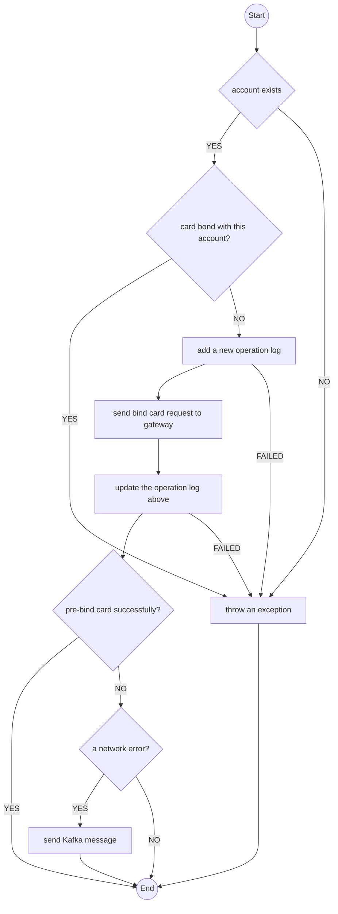

```mermaid
graph TB
  startPoint((Start)) --> accountCheck{account exists}

  accountCheck -- YES --> cardCheck{card bond with this account?}

  accountCheck -- NO --> exception[throw an exception]

  cardCheck -- YES --> exception

  cardCheck -- NO --> addLog[add a new operation log]

  addLog --> gatewayRequest[send bind card request to gateway]

  addLog -- FAILED --> exception

  gatewayRequest --> updateLog[update the operation log above]

  updateLog --> success{pre-bind card successfully?}

  updateLog -- FAILED --> exception

  success -- YES --> endPoint

  success -- NO --> networkError{a network error?}

  networkError -- YES --> notification[send Kafka message]

  networkError -- NO --> endPoint

  notification --> endPoint

  exception --> endPoint((End))
```
