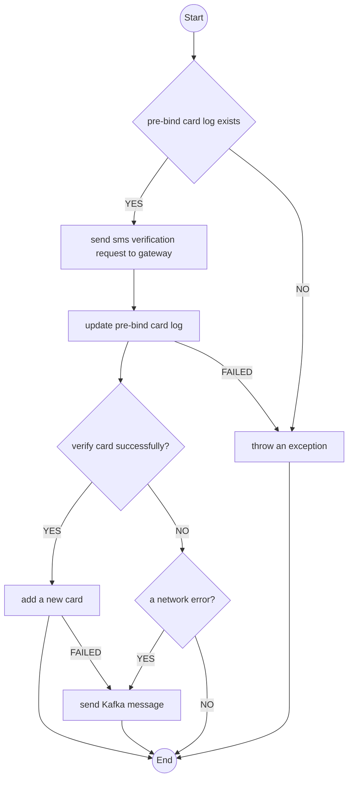

```mermaid
graph TB
  startPoint((Start)) --> preBind{pre-bind card log exists}

  preBind -- YES --> gatewayRequest[send sms verification request to gateway]

  preBind -- NO --> exception[throw an exception]

  exception --> endPoint

  gatewayRequest --> updateLog[update pre-bind card log]

  updateLog --> success{verify card successfully?}

  updateLog -- FAILED --> exception

  success -- YES --> addCard[add a new card]

  addCard --> endPoint

  addCard -- FAILED --> notification

  success -- NO --> networkError{a network error?}

  networkError -- YES --> notification[send Kafka message]

  networkError -- NO --> endPoint

  notification --> endPoint((End))
```
